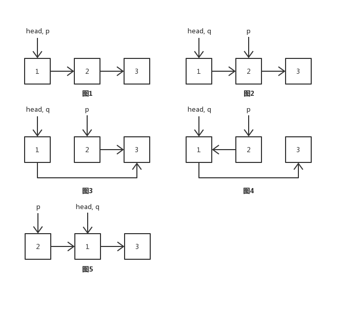
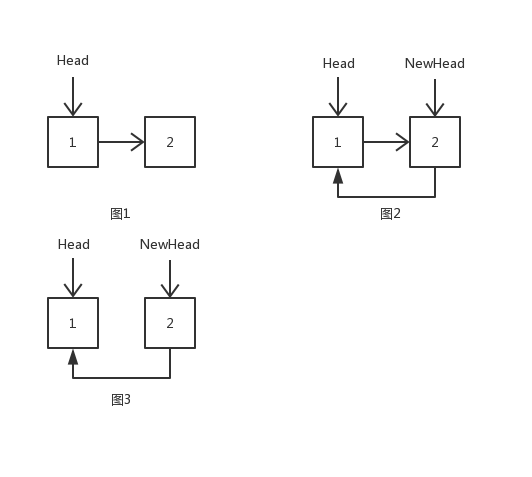

## [206. 反转链表](https://leetcode-cn.com/problems/reverse-linked-list/description/)
反转一个单链表。

示例:
```
输入: 1->2->3->4->5->NULL
输出: 5->4->3->2->1->NULL
```
进阶:
你可以迭代或递归地反转链表。你能否用两种方法解决这道题？

#### 思路一：
迭代实现。重在画图理解

设head为原链表的头节点，p为反转后的链表的头节点，q为辅助节点
```
图1，p = head
图2，q = p，p = head.next
图3，head.next = p.next
图4，p.next = q
图5，整理后的图4
遍历链表，重复图2~5的步骤
```



#### 解答：
```Java
    public static ListNode reverseList(ListNode head) {
        if (head == null) {
            return null;
        }
        // p为反转后的链表的头节点，q为辅助节点，head一直指向原链表的头节点
        ListNode p = head, q;
        while (head.next != null) {
            q = p;
            p = head.next;
            head.next = p.next;
            p.next = q;
        }
        return p;
    }
```

#### 思路二：
递归实现。重在画图理解



#### 解答：
```Java
    public static ListNode reverseList(ListNode head) {
        if (head == null || head.next == null) return head;
        ListNode newHead = reverseList(head.next);
        head.next.next = head;
        head.next = null;
        return newHead;
    }
```
