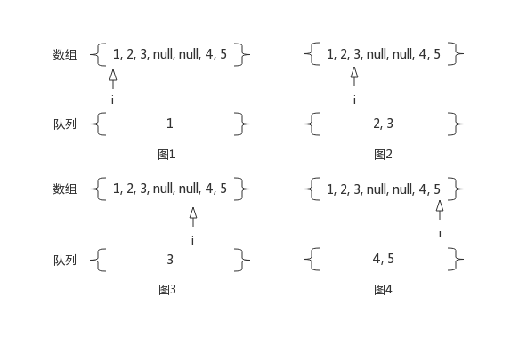

## [297. 二叉树的序列化与反序列化](https://leetcode-cn.com/problems/serialize-and-deserialize-binary-tree/)
序列化是将一个数据结构或者对象转换为连续的比特位的操作，进而可以将转换后的数据存储在一个文件或者内存中，同时也可以通过网络传输到另一个计算机环境，采取相反方式重构得到原数据。

请设计一个算法来实现二叉树的序列化与反序列化。这里不限定你的序列 / 反序列化算法执行逻辑，你只需要保证一个二叉树可以被序列化为一个字符串并且将这个字符串反序列化为原始的树结构。

示例: 
```
你可以将以下二叉树：

    1
   / \
  2   3
     / \
    4   5

序列化为 "[1,2,3,null,null,4,5]"
```

提示: 这与 LeetCode 目前使用的方式一致，详情请参阅 LeetCode 序列化二叉树的格式。你并非必须采取这种方式，你也可以采用其他的方法解决这个问题。

说明: 不要使用类的成员 / 全局 / 静态变量来存储状态，你的序列化和反序列化算法应该是无状态的。

#### 解答

##### 序列化
分析序列化后的字符串的组成结构，那是按照二叉树层次遍历的顺序生成的。另外，如果层次遍历最后的节点为`null`，序列化时需要去除，直至最后一个节点为非空为止。

步骤：

1. 对二叉树进行层次遍历，收集节点
2. 去除遍历节点列表末尾的`null`节点
3. 生成序列化字符串

##### 反序列化
将序列化字符串以`,`为分隔符，生成对应的字符串数组。使用队列保存二叉树的节点，遍历字符串数组，构造二叉树。

步骤：

1. 构造根节点，将其入队
2. 遍历字符串数组
3. 将队首元素出队，从数组中获取其子节点的值，构造子节点，并将子节点入队
4. 遍历结束，返回根节点

`[1,2,3,null,null,4,5]`反序列化过程：

1. 图1为初始状态。此时数组下标`i`为`0`，队列中只有树根节点`1`。接着开始遍历字符串数组
2. 队首`1`出队，队首节点的左右子树节点分别对应数组中下标为`i+1, i+2`的元素，即`2`和`3`。获取数组中左右子树节点对应的元素，同时`i`自增。构造子节点，并将子节点入队。完成后如图2
3. 队首`2`出队，同步骤2一样，完成后如图3
4. 队首`3`出队，同步骤2一样，完成后如图4
5. 遍历结束



另外需要注意数组下标越界的问题，因为序列化的时候，去除了遍历节点列表末尾的`null`节点

```java
    public static String serialize(TreeNode root) {
        if (root == null) {
            return "[]";
        }
        List<TreeNode> nodes = new ArrayList<>(); // 保存序列化的节点
        nodes.add(root); // 添加根节点
        TreeNode node;
        // 目前为止的节点个数
        int count;
        // 每一层的第一个节点和最后一个节点的下标
        int start = 0, end = 0;
        // 如果访问完一层后，子节点个数为0，证明已经二叉树已经遍历完毕
        while (end - start >= 0) {
            count = nodes.size();
            for (int i = start; i <= end; i++) {
                node = nodes.get(i);
                if (node != null) {
                    nodes.add(node.left);
                    nodes.add(node.right);
                }
            }
            start = end + 1;
            // nodes.size() - count为这一层的子节点个数
            end = end + nodes.size() - count;
        }
        // 移除末尾的null
        for (int i = nodes.size() - 1; i >= 0; i--) {
            if (nodes.get(i) != null) {
                break;
            }
            nodes.remove(i);
        }
        // 生成字符串
        StringBuilder sb = new StringBuilder(64);
        sb.append('[');
        for (int i = 0, size = nodes.size(); i < size; i++) {
            node = nodes.get(i);
            if (node == null) {
                sb.append("null");
            } else {
                sb.append(node.val);
            }
            if (i != size - 1) {
                sb.append(',');
            }
        }
        sb.append(']');
        return sb.toString();
    }

    // Decodes your encoded data to tree.
    public static TreeNode deserialize(String data) {
        if ("[]".equals(data)) {
            return null;
        }
        // 去除`[`,`]`，生成values数组
        String[] values = data.substring(1, data.length() - 1).split(",");
        Queue<TreeNode> queue = new LinkedList<>();
        // 添加根节点
        TreeNode root = new TreeNode(Integer.parseInt(values[0]));
        queue.add(root);
        int index = 0, len = values.length;
        while (index < len) {
            // 去除当前节点
            TreeNode node = queue.poll();
            // 判断index + 1后，是否越界
            if (++index >= len) {
                break;
            }
            if (!"null".equals(values[index])) {
                node.left = new TreeNode(Integer.parseInt(values[index]));
                queue.offer(node.left);
            }
            // 判断index + 1后，是否越界
            if (++index >= len) {
                break;
            }
            if (!"null".equals(values[index])) {
                node.right = new TreeNode(Integer.parseInt(values[index]));
                queue.offer(node.right);
            }
        }
        return root;
    }
```