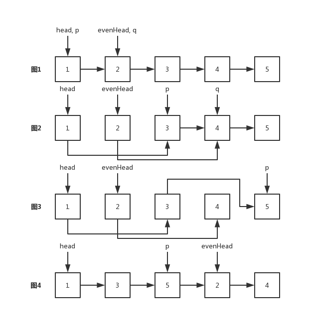

## [328. 奇偶链表](https://leetcode-cn.com/problems/odd-even-linked-list/)
给定一个单链表，把所有的奇数节点和偶数节点分别排在一起。请注意，这里的奇数节点和偶数节点指的是节点编号的奇偶性，而不是节点的值的奇偶性。

请尝试使用原地算法完成。你的算法的空间复杂度应为 O(1)，时间复杂度应为 O(nodes)，nodes 为节点总数。

示例 1:
```
输入: 1->2->3->4->5->NULL
输出: 1->3->5->2->4->NULL
```
示例 2:
```
输入: 2->1->3->5->6->4->7->NULL 
输出: 2->3->6->7->1->5->4->NULL
```
说明:

* 应当保持奇数节点和偶数节点的相对顺序。
* 链表的第一个节点视为奇数节点，第二个节点视为偶数节点，以此类推。

#### 思路：
将原链表拆分成两个链表。其中，一个链表负责存储奇数节点，另一个负责存储偶数节点。当偶数节点遍历到链表最后一个节点时，遍历结束。拆分完成后，再将偶数节点的链表连接到奇数节点链表的尾部。



设指针`p`，`q`分别负责奇偶数节点的遍历。

图1，初始化变量，`p`指向`head`，`q, evenHead`指向`head.next`

图2，第一次遍历，`p.next`指向3，`q.next`指向4，`p, q`各自指向下一个节点

图3，第二次遍历，`p.next`指向5，`q.next`指向`null`，`p, q`各自指向下一个节点。此时，`q = null`

图4，遍历结束，连接两个链表，将`p.next`指向`evenHead`

#### 解答：
```Java
    public static ListNode oddEvenList(ListNode head) {
        if (head == null) {
            return null;
        }
        ListNode p = head, q = head.next;// p,q分别负责奇偶数节点遍历
        ListNode evenHead = head.next;// 指向偶数节点链表头
        while (q != null && q.next != null) {
            p.next = q.next;
            q.next = q.next.next;
            p = p.next;//p 指向最后一个奇数节点
            q = q.next;
        }
        p.next = evenHead;
        return head;
    }
```